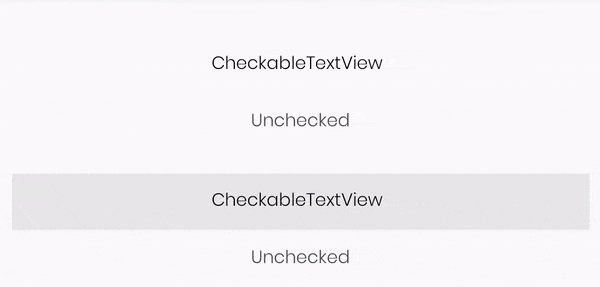
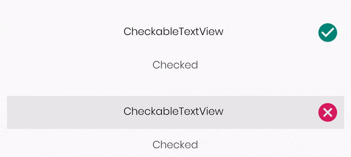
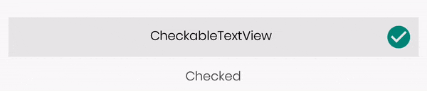

<div align="center">
  
</div>

<h3 align="center">CheckableTextView</h3>


--------------
<a href="https://github.com/JDevZone/CheckableTextView">
</a>

<p><h1 align="left">Checkable TextView [KOTLIN]</h1></p>

<h4 align="center">:zap:A simple and flexible Checked TextView or Checkable TextView written in Kotlin:zap:</h4>

------------------


[](https://jitpack.io/#JDevZone/CheckableTextView)
[![Android Arsenal](https://img.shields.io/badge/Android%20Arsenal-Checkable%20TextView-orange.svg?style=flat&logo=data:image/png;base64,iVBORw0KGgoAAAANSUhEUgAAAEAAAABACAMAAACdt4HsAAABRFBMVEUAAAAA//8AqqoAv79q6tVi69ht7dtm3cwQv59w389L4cNV1cZr5Ndm5tlt585o6NFq6tVm4NYJwadh3NNm5tUIv6dd4NFs6NFq59Rr49Vq5tVC1sFC1cFT28lr5tMJwaZr5dRp5tNq5NJQ28lq5dNQ3Mtq5NJp5NMJwqhr5tNr5tRQ28tS28kKwaZq5tMKwqdr5dRR3MlS2spr5NRR28pp5dNR28lq5NMJwaZp5dMLwacKwKdq5tJp5NNq5tNq5dJR28pQ3Mpq5NNq5dNq5dMKwahq5dNp5dNq5dNZ3s0KwqcKwadq5NMKwqdr5dNq5dNq5tNq5dNq5dNe4c5q5tNR28pf4c5q5dNR28pq5dNr5dNg4tBf4c9n5dIKwacLwagQw6oRxKs30rw40rxQ28dR28pR3Mhg4dBq5dOk7%2bTG9e7///%2bbCjGeAAAAXnRSTlMAAQMEDA0ODxAQERITFBUWGBkdHR4gISE1Nzw%2bQkdRVlhcYGNjZmdobG5wf4CEhIWImJmZmpudo6SnqaurrLW3urvAw8vMz9DR1tzd3eDh4%2bbo6u/w8fHx8vL5/f7%2bnPjfBgAAAWNJREFUeNrt0kdXQjEQBeB5YsGu2FFArNgbNgQRFQtgQ1RECTZ01P%2b/N3IgyCF5yTu4zLfL4t7M4oKmaVUMj88OUnafxwC%2bJUJiDpBwxAhZAL4oISTukOTjhJCo%2bILKGzqdbq/X7eyo/F98Qd0Woc764Ff7dCiJRcngVNuf/I4NpA1DoQxWyAQH5XnWMBJGjt1hljdvyL1mkSv7kmN5IVvg%2bR2F3p4CLC/Sc40mbvtBojuBphJdYKrhBCWO6sHMJkptgwkvKhgFocZLVHDVDCLLqGQRBJpSqOROdMIsMp8Uoug9Iyg4RuabQhS9D4FrAFULsBd4JtQLxoBnHcu%2bKBS/14DnAJXtA88FKjsHnntUloIywzVZ9Pih7KGUcRngz9dkBdK1FdxApLaCPWidXy06taCUmWsB7R%2bMU2yRylwGy%2bYpoPxWF0jlKVaQtrjAqoKIxQWygg0KKLZIObbAQlbTtIIfYmMHMd8lK1oAAAAASUVORK5CYII=)](https://android-arsenal.com/details/1/7770)
[](https://github.com/JDevZone/CheckableTextView/blob/master/LICENSE)

---------------------------
### What's New

| Animation | Demo |
| --- | :---: |
| <p align="center">Normal </br> (duration = 250 ms)</p> |  |
| <p align="center">Custom Duration </br> (duration = 2000 ms)</p> |  |
	
> Sorry for flicker in slow motion video demo . You know android studio screen recorder sucks sometimes :sweat_smile:

### Custom Interpolators
> custom interpolator support added

| Interpolator | Demo |
| --- | :---: |
| <p align="center">BounceInterpolator </br> with fall down animation</p> |  |
| <p align="center">AnticipateOvershootInterpolator </br> with translate animation</p> |  |

<br/><br/>
---------------------------
### Installation

1. Add it in your root build.gradle at the end of repositories:
```groovy
	allprojects {
		repositories {
			...
			maven { url 'https://jitpack.io' }
		}
	}
```


2. Add the dependency in app gradle

```groovy
	dependencies {
	        implementation 'com.github.JDevZone:CheckableTextView:{latest_version}'
	}
```
### Basic usage

```xml
<com.devzone.checkabletextview.CheckableTextView
            app:ctv_TextStyle="@style/TextAppearance.General"
            app:ctv_IconTint="@color/colorAccent"
            app:ctv_IconChecked="true"
            app:ctv_Icon="@drawable/ic_cancel_custom_vector"
            app:ctv_Text="@string/app_name"
            android:layout_width="match_parent"
            android:layout_height="wrap_content"/>
``` 
### Change State Programatically

You can change checked state as follows :
```kotlin
checkedTV.setChecked(isChecked)
```
Default value `shouldNotifyListeners` is false

***or***

```kotlin
checkedTV.setChecked(isChecked,shouldNotifyListeners)
```
 First Boolean parameter `isChecked` sets the current state
 Second Boolean parameter `shouldNotifyListeners` determines
 if `onCheckChange` method should be called or not.
 
### Get Current State
```kotlin
checkedTV.isChecked()
```
No Fancy enums, Just true for checked state and false for unchecked is returned

### Listen State Changes

You can listen to state changes by registering a listener like as follows :
```kotlin
checkedTV.setOnCheckChangeListener()
```
and get callback in implemented method :
```kotlin
override fun onCheckChange(view: View, isChecked: Boolean) {
        // checkedTV returned as view
        // isChecked current state of the view
    }
```
### Set Custom Interpolator

```kotlin
checkedTV.setAnimInterpolator(BounceInterpolator())
```
### Experimental

```kotlin
checkedTV.setClickEnabled(isClickable: Boolean)
```
Pass `isClickable` true for enable and false for disable clicks

> currently restricted to `RestrictTo.Scope.LIBRARY`
> you can use it simply Suppressing Lint Warnings (if have any) as `@SuppressLint("RestrictedApi")`

### Customisation

Here are the attributes you can specify through XML or related setters:
* `ctv_Text` - Set text.
* `ctv_TextSize` - Set text size.
* `ctv_TextColor` - Set text color.
* `ctv_TextStyle` - Set text style.
* `ctv_Icon` - Set custom icon.
* `ctv_IconTint` - Set icon tint.
* `ctv_IconChecked` - Set TextView (`CheckableTextView`) state checked.
* `ctv_TextGravity` - Set text gravity.
* `ctv_AnimType` - Set check animation type currently three available (`scale`,`translate` and `fall_down`).
* `ctv_AnimDuration` - Set duration for check animation.
* `ctv_AnimFirstTime` - Animate `CheckableTextView` for very first time.

### 📄 License

Checkable TextView is released under the MIT license.
See [LICENSE](./LICENSE) for details.


          
